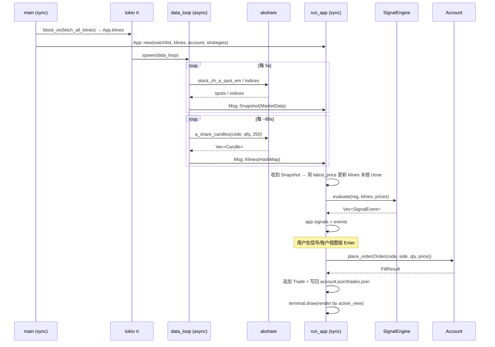

# 系统设计 + 任务分解：A 股模拟交易系统扩展（wbot）

> 架构师：高见远（Gao）。基于 PRD `docs/prd-sim-trading.md` 与现有 `wbot` 代码现状。本文只做设计分解，不含实现代码。
> 技术预研结论（数据源、决策）已由主理人拍板，本文直接采用，不再复述开放问题。

---

## 1. 实现方案与框架选型

**坚持现有技术栈**，不引入新运行时/UI 框架：

- `Rust + tokio`（rt-multi-thread，已用于 `data_loop`）
- `akshare 0.1.14`（已锁定 `Cargo.lock`；仅开 `equity` feature；仅作数据源）
- `ratatui 0.30 + crossterm 0.29`（终端 UI，沿用 `ui.rs` 渲染范式）
- `anyhow`（错误处理，已有）

**新增依赖（写入 `Cargo.toml`）**：

| crate | 用途 | 备注 |
|-------|------|------|
| `serde` + `serde_json` | 账户/交易历史序列化 | `features = ["derive"]`；`account.json` / `trades.json` |
| `toml` | 解析 `strategy.toml` 规则 | `toml 0.8+` 与 edition 2024 兼容（实现时确认） |
| `chrono` | 时间戳与 K 线日期 | `DateTime<Local>` 事件/成交；`NaiveDate` K 线日 |
| `thiserror`（可选） | 自定义错误枚举 | 非必须，可用 `anyhow` 兜底 |

**指标引擎自研（决策 #4）**：定义统一 `Indicator` trait + registry，纯 Rust 作用在自有 `Candle` 序列上，**不**依赖 `akshare::ta`。理由：(1) 满足 PRD「可扩展引擎」要求——新增指标只需实现 trait 并 `register`；(2) 逻辑完全可控、可单测；(3) 与 DSL 表达式 `MA(close,5)` 一一映射，便于规则热加载。

**关键数据流决策**：
- 实时快照维持 5s（`Msg::Snapshot`）。
- 历史 K 线在启动 `block_on` 拉取一次，之后按较慢节奏（默认每 12 个 tick ≈ 60s）增量刷新，通过 `Msg::Klines` 推送（P0 仅刷新最后一根；P1 收盘后整根追加）。
- 信号求值放在**同步 UI 循环 `run_app`** 内：每次收到 `Snapshot` 后，用最新价更新 `klines` 末根 `close`（决策 #5 盘中近似），再对 `scope` 内标的逐条求值 → 写入 `app.signals`。不引入独立 `Msg::Signals`（避免通道膨胀，且信号状态天然属于 App 可变状态）。

---

## 2. 文件列表及相对路径（edition 2024 模块组织）

edition 2024 下推荐用 `src/xxx.rs` 作模块根（优于 `xxx/mod.rs`），其内 `pub mod sub;` 解析为 `src/xxx/sub.rs`。故：

```
wbot/
├── Cargo.toml                      # 新增 serde_json/toml/chrono 依赖
├── strategy.toml                   # 用户规则（运行时新建，含示例）
├── account.json                    # 账户持久化（运行时生成）
├── trades.json                     # 成交历史（运行时追加）
├── watchlist.txt                   # 已有
└── src/
    ├── main.rs                     # 改造：Msg/Klines、data_loop 拉 K 线、run_app 接信号求值+手动下单
    ├── app.rs                      # 改造：新增 View 枚举 + 状态字段（klines/signals/account/...）
    ├── market.rs                   # 改造：新增 fetch_klines() 映射为 Candle；MarketData 可加 klines
    ├── ui.rs                       # 改造为模块根：render() 按 active_view 分派 + 顶部 Tab 栏
    ├── indicators.rs               # 新增：Candle + Indicator trait + IndicatorId + IndicatorRegistry（模块根）
    ├── indicators/
    │   ├── ma.rs                   # MA/SMA/EMA
    │   ├── macd.rs                 # MACD（dif/dea/hist）
    │   ├── rsi.rs                  # RSI
    │   ├── kdj.rs                  # KDJ（P1，默认关闭）
    │   └── boll.rs                 # BOLL（P1）
    ├── signals.rs                  # 新增：SignalNode/StrategyRule/Side/Scope（模块根）
    ├── signals/
    │   ├── dsl.rs                  # TOML → SignalNode 解析 + 指标表达式解析
    │   └── eval.rs                 # SignalEngine：逐标的求值 + 去抖 → SignalEvent
    ├── sim.rs                      # 新增：Account/Position/Order/FillResult（模块根）
    ├── sim/
    │   ├── account.rs              # 账户状态、市值/浮盈、place_order 成交
    │   └── history.rs              # Trade 结构 + 追加/载入 trades.json
    ├── persist.rs                  # 新增：加载/保存 config/account/trades，缺失/损坏兜底默认
    └── config.rs                   # 新增：AppConfig（全局参数 + 默认 scope/费率/lot）
```

**对现有文件的改造点**：
- `main.rs`：`Msg` 增加 `Klines(HashMap<String, Vec<Candle>>)`；`data_loop` 增加 K 线刷新分支；`run_app` 在收到 `Snapshot` 后调用 `SignalEngine::evaluate` 并写入 `app.signals`，键盘新增 `1/2/3/4` 切视图、`Enter` 在信号/账户视图确认下单。
- `app.rs`：`App` 增加 `active_view: View`、`selected_code`、`klines`、`signals`、`strategies`、`account`、`config`；保留 `data/status/last_update/watchlist/scroll*/focus/refresh`。
- `market.rs`：新增 `fetch_klines(client, code, adjust, count) -> Vec<Candle>` 与 `fetch_all_klines(client, codes) -> HashMap<...>`；`SpotQuote` 已含 `code/name/latest_price/change_pct`（`ui.rs` 复用）。
- `ui.rs`：拆为模块根，新增 `ui/market_view.rs`（迁移现有 render 主体）、`ui/indicator_view.rs`、`ui/signal_view.rs`、`ui/account_view.rs`；顶部 Tab 栏复用 `pct_color`。

---

## 3. 数据结构与接口（Rust 类型签名，伪代码）

```rust
// ---------- src/indicators.rs ----------
#[derive(Debug, Clone, Copy)]
pub struct Candle {
    pub date: chrono::NaiveDate,
    pub open: f64, pub high: f64, pub low: f64,
    pub close: f64, pub volume: f64,
}

#[derive(Debug, Clone, Copy, PartialEq, Eq, Hash)]
pub enum PriceSource { Close, Open, High, Low, Volume }

/// DSL "MA(close,5)" → IndicatorId{kind:"MA", source:Close, params:[5], field:None}
#[derive(Debug, Clone, PartialEq, Eq, Hash)]
pub struct IndicatorId {
    pub kind: String,             // MA|SMA|EMA|MACD|RSI|KDJ|BOLL
    pub source: PriceSource,
    pub params: Vec<f64>,
    pub field: Option<String>,    // MACD.dif / KDJ.k / BOLL.mid ...
}

pub trait Indicator: Send + Sync {
    fn eval(&self, series: &[Candle]) -> Vec<f64>; // 等长序列，前导未就绪用 f64::NAN
    fn id(&self) -> IndicatorId;
}

pub struct IndicatorRegistry { /* HashMap<IndicatorId, Box<dyn Indicator>> */ }
impl IndicatorRegistry {
    pub fn new() -> Self;
    pub fn register(&mut self, ind: Box<dyn Indicator>);
    pub fn eval(&self, id: &IndicatorId, series: &[Candle]) -> Option<Vec<f64>>;
}
```

```rust
// ---------- src/signals.rs + src/signals/dsl.rs ----------
#[derive(Debug, Clone, Copy)] pub enum Side { Buy, Sell }
#[derive(Debug, Clone)] pub enum Scope { Watchlist, Codes(Vec<String>) }

#[derive(Debug, Clone)]
pub enum Operand { Indicator(IndicatorId), Number(f64), Price(PriceSource) }
#[derive(Debug, Clone, Copy)] pub enum CmpOp { Gt, Lt, Gte, Lte, Eq }
#[derive(Debug, Clone, Copy)] pub enum CrossDir { Above, Below }

#[derive(Debug, Clone)]
pub enum SignalNode {
    And(Vec<SignalNode>),
    Or(Vec<SignalNode>),
    Not(Box<SignalNode>),
    Cmp { op: CmpOp, left: Operand, right: Operand },
    Cross { dir: CrossDir, left: Operand, right: Operand },
}

#[derive(Debug, Clone, serde::Serialize, serde::Deserialize)]
pub struct StrategyRule {
    pub id: String,
    pub label: String,
    pub side: Side,
    pub scope: Scope,
    pub enabled: bool,
    pub signal: SignalNode,
}

pub fn parse_strategy_file(path: &str) -> anyhow::Result<Vec<StrategyRule>>;
```

```rust
// ---------- src/signals/eval.rs ----------
#[derive(Debug, Clone)]
pub struct SignalEvent {
    pub ts: chrono::DateTime<chrono::Local>,
    pub code: String,
    pub side: Side,
    pub rule_id: String,
    pub reason: String,    // 人类可读触发原因，用于信号视图展示
}

pub struct SignalEngine { rules: Vec<StrategyRule>, prev: HashMap<(String,String), bool> }
impl SignalEngine {
    pub fn new(rules: Vec<StrategyRule>) -> Self;
    /// 对 scope 内每标的求值，返回本周期**新触发**的信号（沿触发去抖）
    pub fn evaluate(
        &mut self,
        reg: &IndicatorRegistry,
        klines: &HashMap<String, Vec<Candle>>,
        prices: &HashMap<String, f64>,
    ) -> Vec<SignalEvent>;
}
```

```rust
// ---------- src/sim.rs / src/sim/account.rs ----------
#[derive(Debug, Clone, serde::Serialize, serde::Deserialize)]
pub struct Position { pub code: String, pub qty: i64, pub avg_cost: f64 }

#[derive(Debug, Clone, serde::Serialize, serde::Deserialize)]
pub struct Account {
    pub initial: f64,
    pub cash: f64,
    pub positions: HashMap<String, Position>,
    pub lot_size: i64,     // 默认 100（决策 #3）
    pub commission: f64,   // 默认 0.0003
    pub stamp_tax: f64,    // 默认 0.0005（仅卖出）
}
impl Account {
    pub fn total_assets(&self, prices: &HashMap<String,f64>) -> f64;
    pub fn unrealized_pnl(&self, prices: &HashMap<String,f64>) -> f64;
    pub fn place_order(&mut self, o: &Order) -> anyhow::Result<FillResult>;
}

#[derive(Debug, Clone)]
pub struct Order { pub code: String, pub side: Side, pub qty: i64, pub price: f64 }
#[derive(Debug, Clone)]
pub struct FillResult { pub realized_pnl: f64, pub fee: f64, pub cash_delta: f64 }
```

```rust
// ---------- src/sim/history.rs ----------
#[derive(Debug, Clone, serde::Serialize, serde::Deserialize)]
pub struct Trade {
    pub ts: chrono::DateTime<chrono::Local>,
    pub code: String, pub side: Side,
    pub price: f64, pub qty: i64,
    pub fee: f64, pub realized_pnl: f64, pub cash_delta: f64,
}
pub fn append_trade(path: &str, t: &Trade) -> anyhow::Result<()>;
pub fn load_trades(path: &str) -> Vec<Trade>;   // 缺失/损坏 → 空 Vec
```

```rust
// ---------- src/config.rs ----------
#[derive(Debug, Clone, serde::Serialize, serde::Deserialize)]
pub struct AppConfig {
    pub default_scope: Scope,
    pub commission: f64,
    pub stamp_tax: f64,
    pub lot_size: i64,
    pub auto_trade: bool,      // P1，默认 false（决策 #1）
    pub kline_adjust: String,  // "qfq"
    pub kline_count: usize,    // 250
}
impl Default for AppConfig { /* 初始资金 1_000_000、费率如上、lot 100 */ }
pub fn load_config() -> AppConfig;   // 缺失 → Default，不崩溃
```

```rust
// ---------- src/app.rs（扩展） ----------
pub enum View { Market, Indicators, Signals, Account }
pub struct App {
    // 新增（模拟交易）
    pub active_view: View,
    pub selected_code: Option<String>,
    pub klines: HashMap<String, Vec<Candle>>,
    pub signals: Vec<SignalEvent>,
    pub strategies: Vec<StrategyRule>,
    pub account: Account,
    pub config: AppConfig,
    pub signal_cursor: usize,
    pub trade_cursor: usize,
    // 保留（行情看板）
    pub data: Option<MarketData>,
    pub status: String,
    pub last_update: Option<Instant>,
    pub watchlist: Vec<String>,
    pub scroll_gainers: u16,
    pub scroll_losers: u16,
    pub focus: Focus,
    pub refresh: u64,
}
```

```rust
// ---------- src/main.rs（通道扩展） ----------
enum Msg {
    Snapshot(market::MarketData),
    Klines(HashMap<String, Vec<Candle>>),
    Error(String),
}
```

---

## 4. 程序调用流程（时序）



文字描述：启动 → `main` 用 `rt.block_on` 拉取全部 watchlist 历史 K 线写入 `App.klines`，并加载 `strategy.toml`/`account.json`/`trades.json`（缺失则兜底默认）→ 进入 UI 循环。`data_loop` 每 5s 推 `Msg::Snapshot`（实时快照），每 ~60s 推 `Msg::Klines`（K 线增量）。`run_app` 收到 `Snapshot` 后：更新 `app.data` → 用 `latest_price` 覆盖 `klines` 末根 `close`（盘中近似）→ 调 `SignalEngine::evaluate` 写入 `app.signals`（沿触发去抖）。用户用 `1/2/3/4` 切视图；在信号/账户视图用 `↑/↓` 选标的、`Enter` 以最新价市价下单（决策 #1 仅手动）→ `Account::place_order` 计算手续费/印花税、更新持仓与现金 → 追加 `Trade` 并落盘 `account.json`/`trades.json`。`r` 强制刷新、`q`/`Esc` 退出。

---

## 5. 有序任务列表（含依赖，按实现顺序）

> 标注：P0=本迭代必做；P1/P2=后续。依赖为前置任务编号。
> 模块文件按 §2 树组织；下表「目标文件」给出主要改动文件。

- **T1 · Candle + Indicator trait + registry 骨架**
  - 目标：`src/indicators.rs`
  - 内容：`Candle`/`PriceSource`/`IndicatorId`/`Indicator` trait/`IndicatorRegistry`（含 `register`/`eval`，前导未就绪返回 `f64::NAN`）。
  - 依赖：无　**P0**

- **T2 · MA / SMA / EMA**
  - 目标：`src/indicators/ma.rs`
  - 内容：任意 `PriceSource`、任意周期；`MA=SMA` 别名、`EMA` 递推实现；登记到 registry。
  - 依赖：T1　**P0**

- **T3 · MACD**
  - 目标：`src/indicators/macd.rs`
  - 内容：`dif=EMA(12)-EMA(26)`、`dea=EMA(dif,9)`、`hist=2*(dif-dea)`；通过 `IndicatorId.field` 取 `dif/dea/hist`。
  - 依赖：T1,T2　**P0**

- **T4 · RSI**
  - 目标：`src/indicators/rsi.rs`
  - 内容：默认 14，Wilder 平滑；单序列输出。
  - 依赖：T1　**P0**

- **T5 · KDJ / BOLL（预留接口 + 示例实现）**
  - 目标：`src/indicators/kdj.rs`、`src/indicators/boll.rs`
  - 内容：KDJ(9,3,3) 输出 `k/d/j`；BOLL(20,2) 输出 `mid/upper/lower`；默认策略中不启用（决策：P1 扩展）。
  - 依赖：T1　**P1**

- **T6 · 信号 DSL 解析**
  - 目标：`src/signals.rs`、`src/signals/dsl.rs`
  - 内容：`toml` → `Vec<StrategyRule>`；递归解析 `SignalNode`（and/or/not + gt/lt/gte/lte/eq + cross_above/below）；解析指标表达式 `NAME(src,params).field` → `IndicatorId`/`Operand`；`Scope`/`Side` 映射。**兜底**：文件缺失/损坏 → 空规则集 + 提示，不崩溃。
  - 依赖：T1　**P0**

- **T7 · 信号求值引擎**
  - 目标：`src/signals/eval.rs`
  - 内容：`SignalEngine::evaluate` 对 `scope` 内每标的：按 `IndicatorId` 经 registry 求序列 → 递归求值 `SignalNode`（cross 取末两根比较）→ 沿触发去抖（上一根未触发、本根触发才发 `SignalEvent`）→ 生成 `reason` 文案。
  - 依赖：T2,T3,T4（指标就绪）,T6（DSL）　**P0**

- **T8 · 模拟账户 / 成交 / 盈亏**
  - 目标：`src/sim.rs`、`src/sim/account.rs`、`src/sim/history.rs`
  - 内容：`Account::place_order`（整手向下取整 `lot_size`、现金不足拒买、持仓不足拒卖、手续费+印花税）、`total_assets`/`unrealized_pnl`、`FillResult`；`Trade` 追加/载入（JSON）。
  - 依赖：无（独立于指标）　**P0**

- **T9 · 配置与持久化**
  - 目标：`src/config.rs`、`src/persist.rs`
  - 内容：`AppConfig` 加载（兜底 `Default`）；`account.json` 读/写；`trades.json` 追加/读；统一兜底：缺失/损坏不 panic。
  - 依赖：T8（账户结构）　**P0**

- **T10 · market.rs 历史 K 线接入**
  - 目标：`src/market.rs`
  - 内容：新增 `fetch_klines(client, code, adjust, count)`（`a_share_candles` 结果映射为 `Candle`）+ `fetch_all_klines(client, codes)` → `HashMap<code, Vec<Candle>>`。
  - 依赖：T1（Candle）　**P0**

- **T11 · app.rs 状态扩展**
  - 目标：`src/app.rs`
  - 内容：新增 `View` 枚举与 `active_view/selected_code/klines/signals/strategies/account/config/signal_cursor/trade_cursor`；`App::new` 接收 klines/account/strategies。
  - 依赖：T7,T8,T9,T10（聚合各结构）　**P0**

- **T12 · main.rs 编排**
  - 目标：`src/main.rs`
  - 内容：`Msg::Klines` 加入；`data_loop` 增加 K 线慢刷新分支；`main` 启动 `block_on(fetch_all_klines)` 初始化 `App.klines`；`run_app` 收到 `Snapshot` 后更新末根 close 并调 `SignalEngine::evaluate` → `app.signals`；加载 `strategy.toml`/`account.json`。
  - 依赖：T7,T10,T11　**P0**

- **T13 · UI 多视图 + Tab**
  - 目标：`src/ui.rs`（模块根）+ `src/ui/market_view.rs`、`indicator_view.rs`、`signal_view.rs`、`account_view.rs`
  - 内容：`render()` 按 `app.active_view` 分派 + 顶部 Tab 栏（4 视图，激活高亮，复用 `pct_color`）；`market_view` 迁移现有渲染主体；`indicator_view` 展示选中标的 MA/MACD/RSI 数值与状态文案；`signal_view` 列表+光标；`account_view` 现金/总资产/持仓表/成交表（分页）；键盘 `1/2/3/4` 切视图、`↑/↓`/`j/k` 滚动、`Tab` 仅在行情视图切涨跌榜（保持原语义）。
  - 依赖：T11　**P0**

- **T14 · 接线信号 → 视图 → 手动下单**
  - 目标：`src/main.rs`(键盘分支)、`src/ui/signal_view.rs`、`src/ui/account_view.rs`
  - 内容：`Enter` 在信号/账户视图对 `selected_code` 下市价单（买/卖按信号 `side` 或视图上下文）→ `Account::place_order` → 追加 `Trade` → 写回 `account.json`/`trades.json`；`P1` 加 `auto_trade` 开关（默认 false，命中信号自动下单）。
  - 依赖：T12,T13　**P0（手动）/ P1（自动）**

---

## 6. 共享知识（跨文件约定）

- **配色**：复用 `ui.rs` 现有 `pct_color`（涨=红、跌=绿，中国习惯）；浮盈红、浮亏绿。
- **数值格式化**：价格 `%.2`；涨跌幅/百分比 `%.2%` 带符号（`+`/`-`）；盈亏带符号+颜色。
- **错误处理**：统一 `anyhow::Result`；文件缺失/损坏一律兜底默认（初始资金 `1_000_000`、空策略、空成交），**绝不 panic**；网络失败沿用现有 `Msg::Error` 提示。
- **命名**：模块/函数 `snake_case`，类型/枚举 `CamelCase`；事件/成交时间戳 `chrono::DateTime<Local>`，K 线日期 `NaiveDate`。
- **整手与费率**：买入数量向下取整到 `lot_size`(默认100) 整数倍；卖出同；手续费 `commission`(默认0.0003) 双边、印花税 `stamp_tax`(默认0.0005) 仅卖出；均来自 `AppConfig`/账户。
- **键盘映射（避免与现有 `r`/`q`/`Esc`/`Tab`(行情内) 冲突）**：
  - `1`/`2`/`3`/`4` → 切 Market / Indicators / Signals / Account 视图
  - `Tab` → 仅 Market 视图内切 Gainers/Losers（原语义保留）
  - `↑`/`↓` 或 `j`/`k` → 当前视图内滚动/移动光标
  - `Enter` → Signals/Account 视图对选中标的确认下单
  - `r` 刷新、`q`/`Esc` 退出（保留）
  - 账户重置入口为 **P1**，另选键（避免与 `r` 冲突，如 `Ctrl+R` 或配合视图的 `R`），待实现确认。
- **盘中信号语义**：日 K 下用 `latest_price` 覆盖末根 `close` 后重算指标与 cross，接受盘中假突破（决策 #5）。
- **多策略并行**：多条规则独立作用于同一标的，各自产出 `SignalEvent`（决策 #7），信号视图按时间倒序列出。

---

## 7. 待明确事项（工程师实现时按编译器/registry 源码确认）

1. **`a_share_candles` 真实返回结构体名与字段**：预研提及可能为 `HistData` 之类，字段含 `date/open/high/low/close/volume`。实现时以 `akshare 0.1.14` registry 源码/编译器为准，再写 `fetch_klines` 映射。
2. **`stock::feature` 的 feature 开关**：预研认为现有 `equity` feature 已覆盖 `stock::feature` 的 `a_share_candles`；若编译报 feature 缺失，需在 `Cargo.toml` 增开对应 feature（勿升级 crate 版本）。
3. **`Indicator::eval` 前导未就绪表示**：建议用 `f64::NAN`（cross 比较时 `NaN` 视为未触发）；若工程师倾向 `0` 需全局统一，避免 cross 误触发。
4. **去抖策略细节**：P0 采用「沿触发」（上一根未触发、本根触发才发事件）；若需「最小间隔」再扩展。
5. **`toml` crate 与 edition 2024 兼容**：`toml 0.8+` 理论兼容；若依赖解析报错，回退到内嵌 `serde_json` 版 `strategy.json`（PRD 允许备选 JSON）。
6. **K 线慢刷新节奏**：默认每 12 个 5s tick（≈60s）刷新一次；具体计数常量可在 `AppConfig` 或 `main` 常量定义。
7. **`SpotQuote` 字段名**：`ui.rs`/`market.rs` 已使用 `code/name/latest_price/change_pct`；新增信号视图取最新价沿用同字段，无需改 akshare 调用。
